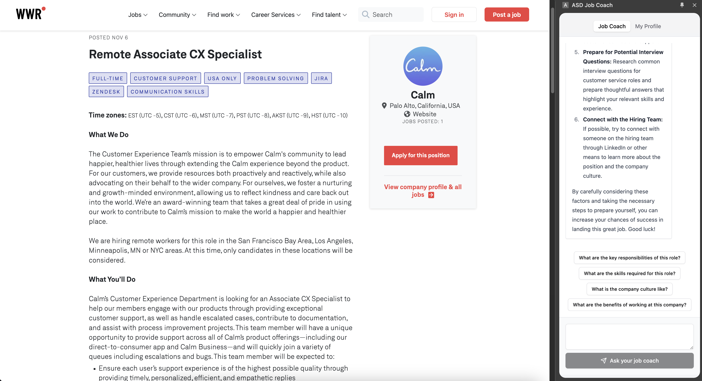

# ASD Job Coach

This is a functional prototype of a Google Chrome extension that helps job seekers with Autism Spectrum Disorder (ASD) find jobs that are a good fit for them and to help them prepare cover letters and resumes, as well as prepare and practice for interviews.

This prototype was created as a proof of concept for a design exploration of an LLM-based application as part of coursework for CS-8001 LLM Seminar at Georgia Tech.

This is not a production-ready application and should not be used as such. It is not supported and should not be used for any real-world purposes. It is merely a proof of concept.

## Requirements
- Node.js version 20+
- Google Chrome browser
- Enable "Developer mode" in Chrome extensions settings
- Enable "Gemini Nano" (See https://medium.com/google-cloud/get-started-with-chrome-built-in-ai-access-gemini-nano-model-locally-11bacf235514)

## Running the prototype

1. Clone the repository.
2. Run `npm install` to install the dependencies.
3. Run `npm run build` to build the extension.
4. Open Google Chrome and go to `chrome://extensions/`
5. Enable "Developer mode" if it is not already.
6. Click "Load unpacked" and select the `dist` folder inside the cloned repository.
7. Open a new tab and go to any job listing site*, such as [this job listing](https://weworkremotely.com/remote-jobs/calm-associate-cx-specialist/)
8. Click the ASD Job Coach icon in the Chrome toolbar to open the extension
9. Click the "Profile" button to open the profile panel. 
10. Enter your profile information, then click "Update your profile"
10. Click the "Job Coach" button to open the job coach panel.
11. Click a question or enter your own question to get a response.

## Limitations

This prototype is currently only supported on We Work Remotely (https://weworkremotely.com) and will not work on other job listing sites. A future version of this extension, should it be developed beyond this prototype, would support multiple job listing sites.

This prototype does not currently support any accommodations other than autism. A future version of this extension, should it be developed beyond this prototype, may support accommodations other than autism.

## Technologies
- Node.js
- React
- TypeScript
- Vite
- ShadCN UI React
- React Hook Form
- Storybook
- Zod
- Gemini Nano

## License

The source code is publicly available on GitHub for now, but will be moved to a private repository after the end of the course.
It is not open source. Use at your own risk.
